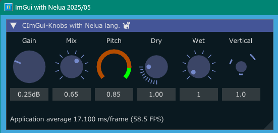

<!-- START doctoc generated TOC please keep comment here to allow auto update -->
<!-- DON'T EDIT THIS SECTION, INSTEAD RE-RUN doctoc TO UPDATE -->

- [NeluaImGui](#neluaimgui)
  - [Prerequisites](#prerequisites)
  - [Build and run on Windows OS](#build-and-run-on-windows-os)
  - [Examples](#examples)
    - [imKnobsDemo](#imknobsdemo)
    - [imSpinnerDemo](#imspinnerdemo)
    - [glfw_opengl3, sdl2_opengl3](#glfw_opengl3-sdl2_opengl3)
    - [iconFontViewer](#iconfontviewer)
    - [glfw_opengl3_jp](#glfw_opengl3_jp)
  - [SDL2 / GLFW / STB headers for Nelua](#sdl2--glfw--stb-headers-for-nelua)
  - [Available librares list](#available-librares-list)
  - [My tools version](#my-tools-version)
  - [History](#history)
  - [Other ImGui / CImGui project](#other-imgui--cimgui-project)
  - [SDL game tutorial Platfromer](#sdl-game-tutorial-platfromer)

<!-- END doctoc generated TOC please keep comment here to allow auto update -->

### NeluaImGui

ImGui / CImGui wrapper library and some examples with NeLua language

Now work in progress.

ImGui / CImGui 1.91.8 (2025/03) 

#### Prerequisites

---

- Install [MSys2/MinGW](https://www.msys2.org/) (Windows OS)
- Install [NeLua](https://nelua.io/installing/)
- Windows OS 10 or later
   1. Install libraries
   
      ```sh
      pacman -S mingw-w64-x86_64-{glfw,pkgconf,SDL2,SDL2_image} make
      ```

- Linux: Ubuntu / Debian families  
   1. Install libraries

      ```sh
      $ sudo apt install xorg-dev libopengl-dev libgl1-mesa-dev make
      ```

      and for glfw3 and sdl2,

      ```sh
      $ sudo apt install libglfw3 libglfw3-dev
      $ sudo apt install libsdl2-dev
      ```
- C/C++ Compiler  
GCC

#### Build and run on Windows OS

---

1. Download this project.

   ```sh
   git clone --recurse-submodules https://github.com/dinau/neluaImGui
   ```
1. Open **MSys2 console** and go to one of the examples folder ,

   ```sh
   cd neluaImGui/examples/glfw_opengl3
   ```

1. Build and run 

   ```sh
   make run 
   ```

####  Examples

---

##### imKnobsDemo

---

[imKnobsDemo.nelua](examples/imKnobsDemo/imKnobsDemo.nelua) 



##### imSpinnerDemo

---

[imSpinnerDemo.nelua](examples/imSpinnerDemo/imSpinnerDemo.nelua) 


##### glfw_opengl3, sdl2_opengl3

---

[glfw_opengl3.nelua](examples/glfw_opengl3/glfw_opengl3.nelua), 
[sdl2_opengl3.nelua](examples/sdl2_opengl3/sdl2_opengl3.nelua)

1. Icon fonts
1. Image loader and saving [jpg, bmp, png, tga]
1. Magnifying glass  
1. glfw_opengl3: Static link [^dllWindows]
1. sdl2_opengl3: Dynamic link

   

##### iconFontViewer 

---

[iconFontViewer.nelua](examples/iconFontViewer/iconFontviewer.nelua) 

1. Icon fonts
1. Magnifying glass  
1. Static link [^dllWindows]

   

[^dllWindows]: Only Windows executables (without .dll dependencies)

##### glfw_opengl3_jp

---

Showing multibyte fonts(UTF-8, CJK fonts) and IME(Input method)

[glfw_opengl3_jp.nelua](examples/glfw_opengl3_jp/glfw_opengl3_jp.nelua) 


#### SDL2 / GLFW / STB headers for Nelua

---

These header files [libs/nelua/glfw](libs/nelua/glfw), [libs/nelua/sdl2](libs/nelua/sdl2), [libs/nelua/stb](libs/nelua/stb) have thankfully been copied form [nelua-decl libraries project](https://github.com/edubart/nelua-decl).

#### Available librares list at this moment

---

Library name / C lang. wrapper

- [x] [ImGui](https://github.com/ocornut/imgui) / [CImGui](https://github.com/cimgui/cimgui) (2024/11)
- [ ] [ImPlot](https://github.com/epezent/implot) / [CImPlot](https://github.com/cimgui/cimplot)
- [ ] [ImPlot3d](https://github.com/brenocq/implot3d) / [CImPlot3d](https://github.com/cimgui/cimplot3d) 
- [ ] [ImNodes](https://github.com/Nelarius/imnodes) / [CImNodes](https://github.com/cimgui/cimnodes)
- [ ] [ImGuizmo](https://github.com/CedricGuillemet/ImGuizmo) / [CImGuizmo](https://github.com/cimgui/cimguizmo)
- [x] [ImGui-Knobs](https://github.com/altschuler/imgui-knobs) / [CImGui-Knobs](https://github.com/dinau/imguin/tree/main/src/imguin/private/cimgui-knobs) (2025/05)
- [ ] [ImGuiFileDialog](https://github.com/aiekick/ImGuiFileDialog) / [CImGuiFileDialog](https://github.com/dinau/CImGuiFileDialog)
- [ ] [ImGui_Toggle](https://github.com/cmdwtf/imgui_toggle) / [CimGui_Toggle](https://github.com/dinau/cimgui_toggle)
- [x] [ImSpinner](https://github.com/dalerank/imspinner) / [CImSpinner](https://github.com/dinau/cimspinner) (2025/05)
- [ ] [ImGuiColorTextEdit](https://github.com/santaclose/ImGuiColorTextEdit) / [cimCTE](https://github.com/cimgui/cimCTE)
- [ ] [ImGui_Markdown](https://github.com/enkisoftware/imgui_markdown) 

#### My tools version

---

- Nelua-0.2.0-dev
- Gcc.exe (Rev1, Built by MSYS2 project) 15.1.0)
- Git version 2.46.0.windows.1
- Make: GNU Make 4.4.1

#### History

---

- Started project at 2024/11 from NeLua-0.2.0-dev : ImGui/CImGui 1.91.4

#### Other ImGui / CImGui project

---


| Language [^order]    |          | Project                                                                                                                                         |
| -------------------: | :---:    | :----------------------------------------------------------------:                                                                              |
| **Lua**              | Script   | [LuaJITImGui](https://github.com/dinau/luajitImGui)                                                                                             |
| **NeLua**            | Compiler | [NeLuaImGui](https://github.com/dinau/neluaImGui)                                                                                               |
| **Nim**              | Compiler | [ImGuin](https://github.com/dinau/imguin), [Nimgl_test](https://github.com/dinau/nimgl_test), [Nim_implot](https://github.com/dinau/nim_implot) |
| **Python**           | Script   | [DearPyGui for 32bit WindowsOS Binary](https://github.com/dinau/DearPyGui32/tree/win32)                                                         |
| **Ruby**             | Script   | [igRuby_Examples](https://github.com/dinau/igruby_examples)                                                                                     |
| **Zig**, C lang.     | Compiler | [Dear_Bindings_Build](https://github.com/dinau/dear_bindings_build)                                                                             |
| **Zig**              | Compiler | [ImGuinZ](https://github.com/dinau/imguinz)                                                                                                     |


#### SDL game tutorial Platfromer

---


| Language    [^order] |          | SDL         | Project                                                                                                                                               |
| -------------------: | :---:    | :---:       | :----------------------------------------------------------------:                                                                                    |
| **LuaJIT**           | Script   | SDL2        | [LuaJIT-Platformer](https://github.com/dinau/luajit-platformer)
| **Nelua**            | Compiler | SDL2        | [NeLua-Platformer](https://github.com/dinau/nelua-platformer)
| **Nim**              | Compiler | SDL3 / SDL2 | [Nim-Platformer-sdl2](https://github.com/def-/nim-platformer)/ [Nim-Platformer-sdl3](https://github.com/dinau/sdl3_nim/tree/main/examples/platformer) |
| **Ruby**             | Script   | SDL3        | [Ruby-Platformer](https://github.com/dinau/ruby-platformer)                                                                                           |
| **Zig**              | Compiler | SDL2        | [Zig-Platformer](https://github.com/dinau/zig-platformer)                                                                                             |

[^order]: Alphabectial order
