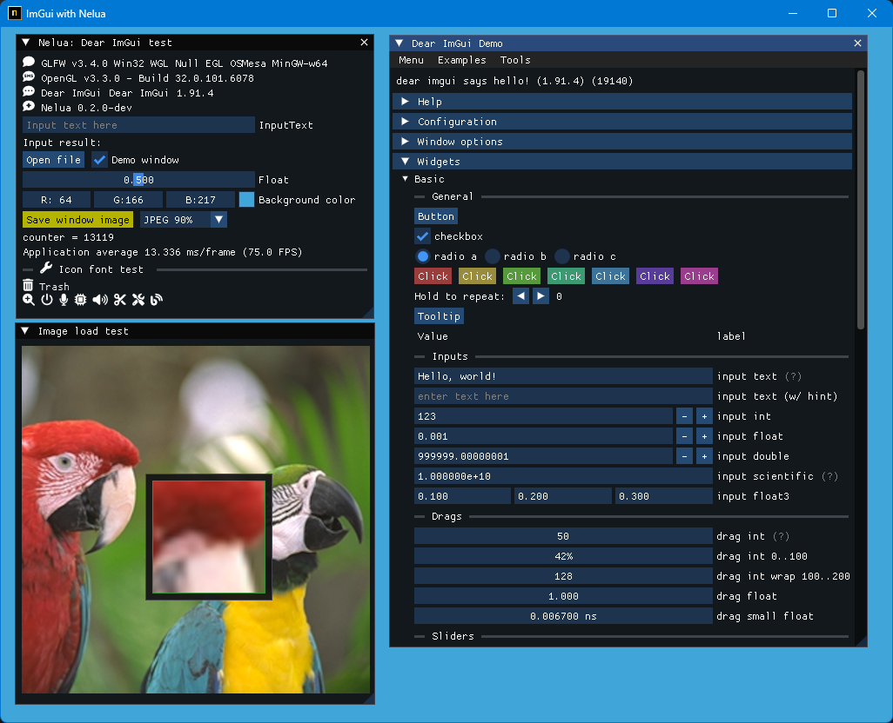

<!-- START doctoc generated TOC please keep comment here to allow auto update -->
<!-- DON'T EDIT THIS SECTION, INSTEAD RE-RUN doctoc TO UPDATE -->

- [NeluaImGui](#neluaimgui)
  - [Prerequisites](#prerequisites)
  - [Build and run](#build-and-run)
  - [Examples](#examples)
    - [glfw_opengl3](#glfw_opengl3)
    - [iconFontViewer](#iconfontviewer)
  - [My tools version](#my-tools-version)
  - [History](#history)
  - [Similar project](#similar-project)

<!-- END doctoc generated TOC please keep comment here to allow auto update -->

### NeluaImGui

ImGui / CImGui wrapper for NeLua language

My experiment project for NeLua and ImGui / CImGui libraries.

Now work in progress.

#### Prerequisites

---
1. Windows OS 10 or later
1. Install [MSys2/MinGW](https://www.msys2.org/) 
1. Install [NeLua](https://nelua.io/installing/)
1. Install libraries

   ```sh
   pacman -S mingw-w64-x86_64-glfw 
   ```

1. Other tools

   ```sh
   pacman -S make
   ```

#### Build and run

---

1. Download this project.

   ```sh
   git clone --recurse-submodules https://github.com/dinau/neluaImGui
   ```
1. Go to one of the examples folder,

   ```sh
   cd neluaImGui/examples/glfw_opengl3
   ```

1. Build and run 

   ```sh
   make run 
   ```

####  Examples

---

##### glfw_opengl3

1. Icon fonts
1. Image loader
1. Image saving [jpg, bmp, png, tga]
1. Magnifying glass  

   

##### iconFontViewer 

1. Icon fonts
1. Magnifying glass  

   

#### My tools version

---

- Nelua-0.2.0-dev
- Gcc.exe (Rev1, Built by MSYS2 project) 14.2.0)
- Git version 2.46.0.windows.1
- Make: GNU Make 4.4.1

#### History

---

- Started project at 2024/11 from NeLua-0.2.0-dev : ImGui/CImGui 1.91.4

#### Similar project

---

| Language             | Project                                                                                                                                         |
| -------------------: | :----------------------------------------------------------------:                                                                              |
| **Nim**              | [ImGuin](https://github.com/dinau/imguin), [Nimgl_test](https://github.com/dinau/nimgl_test), [Nim_implot](https://github.com/dinau/nim_implot) |
| **Lua**              | [LuaJITImGui](https://github.com/dinau/luajitImGui)                                                                                             |
| **Python**           | [DearPyGui for 32bit WindowsOS Binary](https://github.com/dinau/DearPyGui32/tree/win32)                                                         |
| **Zig**, C lang.     | [Dear_Bindings_Build](https://github.com/dinau/dear_bindings_build)                                                                             |
| **Zig**              | [ImGuinZ](https://github.com/dinau/imguinz)                                                                                                     |
| **NeLua**            | [NeLuaImGui](https://github.com/dinau/neluaImGui)                                                                                                     |
